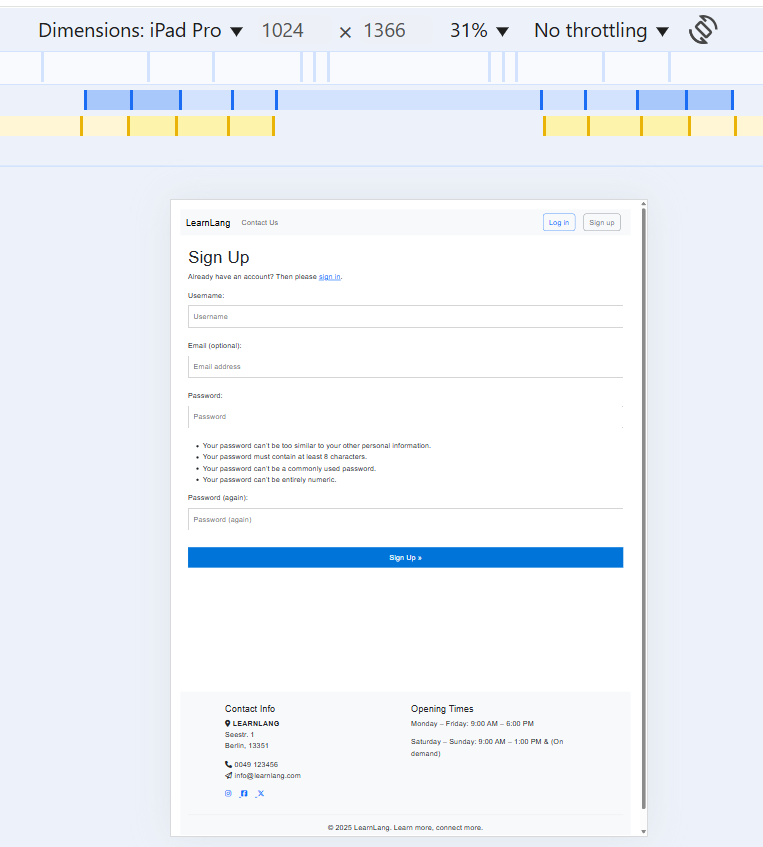

# Testing

> [!NOTE]  
> Return back to the [README.md](README.md) file.

Overview
This section documents the manual testing conducted for the LearnLang application. The purpose of this testing was to ensure that all features function as intended, that users can navigate the site with ease, and that the application provides a smooth and intuitive experience for learners and tutors.
The tests were carried out across multiple devices (desktop, tablet, mobile) and browsers (Chrome, Firefox, Safari) to ensure cross-platform compatibility.

Testing Approach
Manual testing was conducted on each feature and page of the site, checking both the functionality and the user experience. Each test aimed to simulate real-world use cases for both authenticated and unauthenticated users.

## Code Validation

This section documents the code validation performed on all custom LearnLang project files (excluding third-party libraries, frameworks, and auto-generated files). The aim was to ensure that the code follows best practices, is free of syntax errors, and meets HTML, CSS, JavaScript, and Python coding standards.
All files were validated using relevant tools for their file type.
External libraries (e.g., Bootstrap, Font Awesome, Django Allauth,) were not validated, as these are maintained by their respective developers.

Validation Tools Used
    • HTML: W3C Markup Validation Service
    • CSS: W3C CSS Validation Service
    • JavaScript: JSHint
    • Python: PEP8 / Flake8

Validation Process & Results
1. HTML Files
   
Tested:

    • templates/home.html
    • templates/english.html
    • templates/tutor.html
    • templates/booking.html
    • templates/my_bookings.html
    • templates/contact_us.html
    • templates/account/login.html
    • templates/account/signup.html
Result:
    • All HTML passed validation with no errors.
    • Minor W3C warnings regarding Bootstrap-related attributes (e.g., aria-*) were ignored, as they are part of the framework.

### HTML

Validation Method
To ensure all HTML files in the LearnLang project are compliant with W3C standards, I validated the live deployed pages using the W3C Markup Validation Service.
Validating via the live URLs ensures the HTML is tested exactly as users see it, including all Django-rendered templates, CSS, and JavaScript.

Link: - https://validator.w3.org/nu/?doc=https://mairima.github.io/learnlang/index.html

- To  validate using this link: https://validator.w3.org/#validate_by_uri

- Otherwise, for copying/pasting the HTML code manually, this link: https://validator.w3.org/#validate_by_input

Live Validation Links (click to re-run validation at any time):
    1. Home Page
Validate
    1. English Courses Page
Validate
    1. Get a Tutor Page
Validate
    1. Booking Page
Validate
    1. My Bookings Page (login required)
Validate
    1. Contact Us Page
Validate
    1. Login Page
Validate
    1. Sign Up Page
Validate

 Result:
All tested pages returned "Document checking completed. No errors found" or only framework-related warnings (e.g., Bootstrap ARIA attributes), which were ignored as they are valid in this context.

I have used the recommended [HTML W3C Validator](https://validator.w3.org) to validate all of my HTML files. The pages were opened and then with a right click to open source code and the source code was used to enter a text validation in the w3 validator website, which all passed.

| Directory | File | URL | Screenshot | Notes |
| --- | --- | --- | --- | --- |
| languages | [login.html](https://github.com/mairima/learnlang/blob/main/languages/templates/account/login.html) |  Link ([if applicable](https://learnlang-e0549c82066a.herokuapp.com/accounts/login/)) |  | |
| languages | [logout.html](https://github.com/mairima/learnlang/blob/main/languages/templates/account/logout.html) | | refer to login validation picture | |
| languages | [signup.html](https://github.com/mairima/learnlang/blob/main/languages/templates/account/signup.html) |Link  ([if applicable](https://learnlang-e0549c82066a.herokuapp.com/accounts/signup/booking/))| refer to login validation picture |  |
| languages | [booking.html](https://github.com/mairima/learnlang/blob/main/languages/templates/booking.html) | Link  ([if applicable](https://learnlang-e0549c82066a.herokuapp.com/booking/)) | refer to login validation picture |  |
| languages | [contact_us.html](https://github.com/mairima/learnlang/blob/main/languages/templates/contact_us.html) |  Link  ([if applicable](https://learnlang-e0549c82066a.herokuapp.com/contact/))| refer to login validation picture  |  |
| languages | [edit_booking.html](https://github.com/mairima/learnlang/blob/main/languages/templates/edit_booking.html) |  Link  ([if applicable](https://learnlang-e0549c82066a.herokuapp.com/my-bookings/))| refer to login validation picture |  |
| languages | [english.html](https://github.com/mairima/learnlang/blob/main/languages/templates/english.html) |  Link ([if applicable](https://learnlang-e0549c82066a.herokuapp.com/english/))| refer to login validation picture |  |
| languages | [home.html](https://github.com/mairima/learnlang/blob/main/languages/templates/home.html) |  Link ([if applicable](https://learnlang-e0549c82066a.herokuapp.com/)) |refer to login validation picture |  |
| languages | [index.html](https://github.com/mairima/learnlang/blob/main/languages/templates/languages/index.html) |  | refer to login validation picture|  |
| languages | [my_bookings.html](https://github.com/mairima/learnlang/blob/main/languages/templates/my_bookings.html) |  Link ([if applicable](https://learnlang-e0549c82066a.herokuapp.com/booking/)) |refer to login validation picture|  |
| languages | [tutor.html](https://github.com/mairima/learnlang/blob/main/languages/templates/tutor.html) |  Link ([if applicable](https://learnlang-e0549c82066a.herokuapp.com/get-tutor/)) |refer to login validation picture |  |
| languages | [admin_dashboard.html](https://github.com/mairima/learnlang/blob/main/languages/templates/tutor.html) |  Link [if applicable](https://learnlang-e0549c82066a.herokuapp.com/dashboard/admin/) |refer to login validation picture |  |

### CSS

I have used the recommended [CSS Jigsaw Validator](https://jigsaw.w3.org/css-validator/validator?uri=https://learnlang-e0549c82066a.herokuapp.com) to validate all of my CSS files.

| Directory | File | URL | Screenshot | Notes |
| --- | --- | --- | --- | --- |
| static | [style.css](https://github.com/mairima/learnlang/blob/main/static/css/style.css) |  Link (if applicable) |  |  |

### JavaScript

I have used the recommended [JShint Validator](https://jshint.com) to validate my JS files.
 

### Python

I have used the recommended [PEP8 CI Python Linter](https://pep8ci.herokuapp.com) to validate all of my Python files.

| Directory | File | URL | Screenshot | Notes |
| --- | --- | --- | --- | --- |
| languages | [admin.py](https://github.com/mairima/learnlang/blob/main/languages/admin.py) | [PEP8 CI Link](https://pep8ci.herokuapp.com/https://raw.githubusercontent.com/mairima/learnlang/main/languages/admin.py) |  | |
| languages | [forms.py](https://github.com/mairima/learnlang/blob/main/languages/forms.py) | [PEP8 CI Link](https://pep8ci.herokuapp.com/https://raw.githubusercontent.com/mairima/learnlang/main/languages/forms.py) |  | |
| languages | [models.py](https://github.com/mairima/learnlang/blob/main/languages/models.py) | [PEP8 CI Link](https://pep8ci.herokuapp.com/https://raw.githubusercontent.com/mairima/learnlang/main/languages/models.py) | refer to forms.py picture| |
| languages | [tests.py](https://github.com/mairima/learnlang/blob/main/languages/tests.py) | [PEP8 CI Link](https://pep8ci.herokuapp.com/https://raw.githubusercontent.com/mairima/learnlang/main/languages/tests.py) | refer to forms.py picture |  |
| languages | [urls.py](https://github.com/mairima/learnlang/blob/main/languages/urls.py) | [PEP8 CI Link](https://pep8ci.herokuapp.com/https://raw.githubusercontent.com/mairima/learnlang/main/languages/urls.py) | refer to forms.py picture | |
| languages | [views.py](https://github.com/mairima/learnlang/blob/main/languages/views.py) | [PEP8 CI Link](https://pep8ci.herokuapp.com/https://raw.githubusercontent.com/mairima/learnlang/main/languages/views.py) | refer to forms.py picture ||
| learnlang | [settings.py](https://github.com/mairima/learnlang/blob/main/learnlang/settings.py) | [PEP8 CI Link](https://pep8ci.herokuapp.com/https://raw.githubusercontent.com/mairima/learnlang/main/learnlang/settings.py) | refer to forms.py picture ||
| learnlang | [urls.py](https://github.com/mairima/learnlang/blob/main/learnlang/urls.py) | [PEP8 CI Link](https://pep8ci.herokuapp.com/https://raw.githubusercontent.com/mairima/learnlang/main/learnlang/urls.py) | refer to forms.py picture ||
| learnlang  | [manage.py](https://github.com/mairima/learnlang/blob/main/manage.py) | [PEP8 CI Link](https://pep8ci.herokuapp.com/https://raw.githubusercontent.com/mairima/learnlang/main/manage.py) | refer to forms.py picture | |

## Responsiveness

I have tested the responsiveness on these devices and all works well: 

- Mobile
- Tablet
- Desktop
- 
| Page | Mobile | Tablet | Desktop | Notes |
| --- | --- | --- | --- | --- |
| Register |  |  |  | Works as expected |
| Home |  |  |  | Works as expected |
| Admin page |  |  |  | Works as expected |

## Browser Compatibility

I've tested my deployed project on multiple browsers to check for compatibility issues.

- [Chrome](https://www.google.com/chrome)
- [Firefox (Developer Edition)](https://www.mozilla.org/firefox/developer)
- [Safari](https://support.apple.com/downloads/safari)

| Page | Chrome | Firefox | Safari | Notes |
| --- | --- | --- | --- | --- |
| Register | refer to responsiveness section, the test default browser is chrome|  |  | Works as expected |
| Login | refer to responsiveness section, the test default browser is chrome |same as register above | same as register above | Works as expected |
| Home | refer to responsiveness section, the test default browser is chrome | same as register above  | same as register above | Works as expected |
| 404 | refer to readme features |same as register above  | same as register above | Works as expected |

## Lighthouse Audit

I've tested my deployed project using the Lighthouse Audit tool to check for any major issues. Some warnings are outside of my control, and mobile results tend to be lower than desktop.

| Page | Desktop | Mobile |
| --- | --- | --- |
| Register |  |  |
| Booking|  |  |
| Home |  |  |
| Admindashbaord |  | same as desktop |
| Adminpage |  | same as desktop |

## Defensive Programming

Defensive programming was manually tested with the below user acceptance testing:
Here, the following were tested:
Users cannot submit an empty form (the `required` attribute was added in signup, login, so that the booking is identified by the logged in user)
- Users must enter valid field types (the correct input `type=""` is used)
- Users cannot brute-force a URL to navigate to a restricted pages

- Users cannot perform CRUD functionality if not authenticated (if login functionality exists)
- User-A should not be able to manipulate data belonging to User-B, or vice versa
- Non-Authenticated users should not be able to access pages that require authentication
- Standard users should not be able to access pages intended for superusers/admins

| Page | Expectation | Test | Result | Screenshot |
| --- | --- | --- | --- | --- |
| Signup | Creates account with strong password | Submit email(optional), username, and strong password; confirm redirect/notice | from the allauth, prompt for strong and consistent password as expected, and all other checks |  |
| Signup | Rejects weak password | Use weak password (e.g., `12345678`) | Result as above |Result as above |
| Signup | Rejects password mismatch | Enter different password & confirm | Result as above | Result as above |
| Signup | Rejects duplicate name | login with an existing user | Result as above|  |
| Signup | Escapes unsafe input (XSS) | Username: ``; view profile/header | Result as above |  |
| Signin | Valid credentials log in and redirect correctly | Login and verify `post_login_redirect` target |Result as above | Refer to home browser section |
| Signin | Wrong credentials show generic error | Right name + wrong password | Result as above |  |
| Booking | Happy path creates booking | Pick course, submit; appears in **My Bookings** | Works as expected, successful bookings are listed on my bookings|  |
| Booking | Email format validated (if provided) | Enter `not-an-email` |Valid|  |
| Booking | Duplicate booking prevented | Book same course twice (user+course unique) | Valid |  |
| Contact Us | Happy path sends/records message | Fill name/email/message; confirm success UI | Works as expected |  |
| Contact Us | Required fields enforced, Email format validated | Submit empty name/message | Valid Email & format must be entered|  |
|Admin| Only admins can reach `/dashboard/admin/` | Log in as non-admin → visit URL directly; expect redirect to `home` | Works as expected |  |
|Admin| Admins can reach dashboard and backend admin page| Log in as staff/superuser or role=`admin` → visit URL | Works as expected |  |

## User Story Testing

| Target | Expectation | Outcome | Screenshot |
| --- | --- | --- | --- |
| As a site administrator | I want to log in and be redirected to /dashboard/admin/, with bookings to show course and user relationships.| So that I can quickly access the admin dashboard. | Refer to the login page on the feature section in Readme |
| As a site administrator | I would like to access the django admin panel (which is a build-in from django and has an integrated crud) | so that I can manage all the website parameters |Refer to the admin page on the feature section in the Readme |
| As a site visitor (not logged in) | I want to visit the relevant pages with good user interface and eventually register and be able to contact the admin | So that I can view all displayed information & more content after login|Refer to the home page on the feature section in the Readme |
| As a logged-in user | I would like to browse available pages, be able to create, read, update and delete  bookings if relevant | so that I can manage my bookings properly. |Refer to the booking page on the feature section in the Readme |
| As a logged-in user | I will like crud on the bookings, so that create i can view, edit,   | so that I can start learning English immediately. |Refer to the my booking page on the feature section in the Readme |

## Automated Testing

### Python (Unit Testing)

### Fixed Bugs

When testing with the validators: I found some errors that i fixed, for example: 

1. Trailing Slash Warning in HTML and some python syntax for example % sign, on the booking, contact and signup page.

solution: 

I opened the page as "view source code" & copied all the code an dthen it could validate in html. 

2. CSS/JS not loading after deploy.
The cause was that WhiteNoise wasn’t configured properly, or collectstatic wasn’t run.

solution: 

Added WhiteNoise to MIDDLEWARE after SecurityMiddleware.
set: STATICFILES_STORAGE = "whitenoise.storage.CompressedManifestStaticFilesStorage"
ran: python manage.py collectstatic

3. Some PEP 8 / Flake8 Warnings in settings.py
   
Solution: 

Added spaces around operators.

Broke long strings and dict entries across lines.

The signup and login pages didn't extend the bootstrap and css styling to match the other pages. The cause was that, It had no  or Bootstrap <link> tags, so it wasn’t inheriting the navbar, footer, or styles.
It was an HTML file without a proper Django template extending the main layout. It needed to have: 

a shared navbar/footer from base.html,
a linked Bootstrap CSS and site styles.
a consistent container/padding.

The fix was to make the signup.html to extend the base.html and put its content in the  section.

### Known Issues
| Issue | 
| --- | 
| On devices smaller than 375px, the page starts to have horizontal `overflow-x` scrolling. | 
| When validating HTML with a semantic `<section>` element, the validator warns about lacking a header `h2-h6`. This is acceptable. |
| Validation errors on "signup.html" coming from the Django Allauth package. | 
